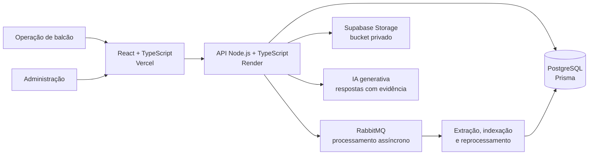

<div align="center">

# CogniVault

### Catálogo técnico inteligente para operação de peças

Centraliza catálogos privados, peças e conhecimento operacional em uma experiência de busca rápida, segura e baseada em evidências.

[Abrir aplicação](https://cognivault-murex.vercel.app) · [Ver no portfólio](https://matheusfranciscols.github.io/#projetos) · [Falar com o autor](https://www.linkedin.com/in/matheusfranciscols)


</div>

<a href="https://cognivault-murex.vercel.app">
  
</a>

## Visão do produto

O **CogniVault** é um sistema interno para consulta de peças, catálogos técnicos e conhecimento operacional. Ele foi projetado para reduzir a dispersão de informação no balcão e tornar a identificação de componentes mais confiável.

A plataforma combina dados estruturados, documentos privados, regras técnicas e IA. Quando a evidência é insuficiente ou existem variantes incompatíveis, o sistema solicita confirmação em vez de inventar um código de peça.

| Problema | Resposta do produto |
| :--- | :--- |
| Catálogos e conhecimento espalhados em diferentes fontes. | Biblioteca central com busca por peça, código, modelo, PNC e número de série. |
| Documentos técnicos sensíveis. | Storage privado, URLs assinadas e autorização aplicada pelo backend. |
| Risco de uma resposta de IA parecer correta sem possuir evidência. | Part Numbers originados de registros estruturados, restrições técnicas e rastreabilidade de fontes. |
| Processamento de PDFs sujeito a falhas e operações demoradas. | Filas, reprocessamento controlado, estados de saúde e rotinas de recuperação. |

## Evidências técnicas verificadas

| 45 | 17 | 12 | 2 |
| :---: | :---: | :---: | :---: |
| arquivos de teste automatizado | migrations versionadas | modelos de domínio no Prisma | perfis operacionais |

> Os números acima foram levantados diretamente na estrutura atual do repositório. Eles demonstram profundidade de engenharia; métricas de uso e impacto operacional não são publicadas porque a aplicação é interna.

## Principais recursos

### Operação de balcão

- Assistente de IA com respostas baseadas em evidências.
- Busca por peça, código, modelo, PNC e número de série.
- Histórico, favoritos, detalhes e compatibilidade.
- Confirmação e correção de resultados por feedback.
- Leitor interno para visualizar e baixar catálogos processados.
- Separação explícita entre evidência técnica, contexto e ranking.

### Administração e qualidade

- Painel com catálogos, peças, usuários e feedback.
- Upload em lote, processamento e reprocessamento de PDFs.
- Arquivamento reversível e exclusão controlada do arquivo original.
- Gestão de usuários e perfis.
- Auditoria de ações administrativas.
- Revisão de metadados, benchmark e radar de qualidade da busca.
- Fluxo de aprovação para verificações oficiais de peças.

## Arquitetura



### Fluxo de conhecimento

```text
UPLOAD → EXTRAÇÃO → INDEXAÇÃO → RECUPERAÇÃO → RESPOSTA → FEEDBACK
```

1. Um administrador envia um catálogo técnico.
2. O backend armazena o original em bucket privado e cria o trabalho de processamento.
3. Peças, PNCs, metadados e contexto são extraídos e persistidos.
4. A busca aplica restrições técnicas e combina diferentes sinais de recuperação.
5. A IA interpreta a consulta e responde sem substituir os dados estruturados de peça.
6. O feedback alimenta revisão, benchmark e manutenção da qualidade.

## Decisões de engenharia

### Segurança aplicada no servidor

O frontend apresenta apenas as ações permitidas, mas a autorização real é validada pelo backend. A conta é reconsultada no banco a cada requisição, portanto bloqueios e mudanças de perfil têm efeito imediato. Não existe autocadastro público.

### Arquivar não é excluir

- **Arquivar** remove o catálogo das consultas, preserva o PDF e permite restauração.
- **Excluir PDF** remove o arquivo do storage de forma irreversível, mantendo o histórico necessário para auditoria.

### IA com limite de confiança

Os códigos exibidos vêm de registros estruturados. Modelo, PNC, número de série, vista e posição podem restringir a busca quando existe evidência no catálogo. Em cenários ambíguos, a aplicação pede contexto adicional.

### Operação observável

- `GET /health/live` confirma que o processo HTTP está ativo.
- `GET /health` verifica PostgreSQL e RabbitMQ e retorna `503` quando uma dependência essencial está indisponível.
- GitHub Actions valida backend e frontend antes da promoção para produção.

## Stack

| Camada | Tecnologias |
| :--- | :--- |
| Frontend | React, TypeScript, Vite, Tailwind CSS |
| Backend | Node.js, TypeScript, Express |
| Dados | PostgreSQL, Prisma ORM |
| Documentos | Supabase Storage privado e URLs assinadas |
| Processamento | RabbitMQ, extração e indexação assíncrona |
| IA e busca | Gemini, recuperação híbrida, ranking, feedback e benchmark |
| Entrega | Vercel, Render e GitHub Actions |

## Estrutura do repositório

```text
CogniVault/
├── frontend/              # aplicação React e experiência operacional
│   └── src/
│       ├── components/    # busca, chat, catálogos, qualidade e administração
│       └── pages/         # autenticação e dashboard
├── backend/               # API, regras de negócio e processamento
│   ├── prisma/            # schema e migrations versionadas
│   └── src/
│       ├── controllers/
│       ├── middleware/
│       ├── queues/
│       ├── services/
│       └── utils/
├── .github/workflows/     # validação contínua
└── render.yaml            # infraestrutura do backend
```

## Execução local

### Backend

```bash
cd backend
npm ci
npx prisma generate
npm run build
npm start
```

Use migrations revisadas em produção:

```bash
npx prisma migrate deploy
```

### Frontend

```bash
cd frontend
npm ci
npm run lint
npm run dev
```

A aplicação usa `VITE_API_URL`; as demais configurações necessárias estão documentadas nos arquivos `.env.example` de cada camada.

## Processamento e recuperação

O PDF local temporário é removido após o processamento. No reprocessamento, o backend recupera o original pelo `storagePath`, cria um temporário, atualiza a extração e o índice e remove o temporário novamente.

A atualização de memória técnica é uma operação separada: reutiliza as peças já extraídas para recalcular memória, categoria e saúde sem reabrir o PDF nem iniciar uma nova extração por IA.

<details>
<summary><strong>English overview</strong></summary>

CogniVault is an internal technical catalog and parts-intelligence platform. It centralizes private documents, structured parts data and operational knowledge with role-based access, asynchronous processing and evidence-grounded AI answers.

The current repository contains **45 automated test files, 17 versioned database migrations, 12 Prisma domain models and 2 operational roles**. Part numbers originate from structured records; AI supports interpretation, context and ranking without replacing technical evidence.

[Open application](https://cognivault-murex.vercel.app) · [View portfolio](https://matheusfranciscols.github.io/) · [Contact Matheus](https://www.linkedin.com/in/matheusfranciscols)

</details>

---

<div align="center">

Projetado e desenvolvido por [Matheus Francisco](https://github.com/MatheusFranciscoLS).

</div>

